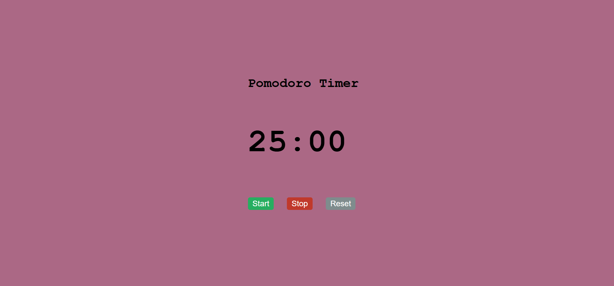

# Pomodoro Timer ⏳

A simple and responsive Pomodoro Timer built using HTML, CSS, and JavaScript to help you stay focused and boost productivity using the Pomodoro technique.

## 🔗 Live Demo
👉 [Click here to try the Pomodoro Timer](https://kumar-veerendra.github.io/pomodoro-timer/)

## 📸 Screenshot


## 💡 Features
- 25-minute Pomodoro work session
- 5-minute short break
- 15-minute long break
- Start, Pause, and Reset options
- Clean and responsive design

## 🚀 Technologies Used
- HTML
- CSS
- JavaScript

## 📁 Folder Structure
```
pomodoro-timer/
├── index.html
├── style.css
├── script.js
├── screenshot.png
└── README.md
```

## 📜 License
This project is open source and available under the [MIT License](LICENSE).
